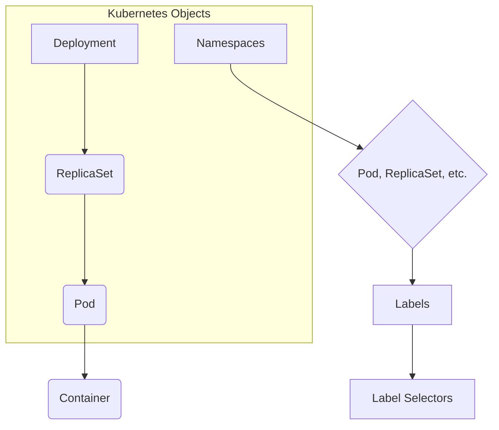

# Kubernetes Basics
## コンテナオーケストレーション

### 講義のテーマ

本講義では、多数のコンテナを効率的に管理するための技術である「**コンテナオーケストレーション**」について解説します。コンテナオーケストレーションが必要とされる背景、その機能、代表的なツール、そして開発者や管理者にとってのメリットを学ぶことができます。

-----

### コンテナオーケストレーションとは？

コンテナオーケストレーションとは、多数のコンテナ化されたアプリケーションのライフサイクルを自動化するプロセスです。

  - **目的**: 多数のコンテナを大規模なアプリケーション（データベース、Webアプリなど）として連携、管理、スケールさせる際の複雑さを解消し、効率化を図ります。
  - **自動化される主なタスク**:
      - デプロイメント（配置）
      - 管理
      - スケーリング（規模の拡大・縮小）
      - ネットワーキング
      - 可用性の確保（高可用性）

#### なぜ必要か？

アプリケーションのグローバル展開や機能追加に伴い、コンテナの数は急速に増加します。数百、数千ものコンテナを手動で管理することは困難であり、非効率です。コンテナオーケストレーションは、このような**大規模で動的な環境**において、以下の利点を提供します。

  - 複雑性の簡素化
  - デプロイメントとスケーリングの自動化
  - 開発のスピードと効率性の向上
  - CI/CD（継続的インテグレーション/継続的デリバリー）やDevOpsへの統合

### 主要な機能

コンテナオーケストレーションツールは、YAMLやJSON形式の**設定ファイル**に基づいて動作し、コンテナのライフサイクルを管理します。

  - **コンテナの定義と配置**: アプリケーションを構成するコンテナイメージの場所（レジストリ）を定義し、自動的にクラスター内の適切なホストに配置します。
  - **リソースの割り当てとスケジューリング**: CPUやメモリなどのシステムパラメータ、ネットワーク設定、ロギングなどを設定ファイルで指定し、インフラストラクチャへのコンテナの配置を管理します。
  - **可用性の確保と自己修復**: ホストの障害やリソース不足が発生した場合、コンテナを別のホストに再配置して、アプリケーションの可用性を維持します。
  - **スケーリングとロードバランシング**: 需要に応じてコンテナの数を自動的に増減させ、リクエストを分散します。
  - **更新とロールバック**: アプリケーションのローリングアップデートを安全に実行し、問題が発生した場合は以前のバージョンに戻すことができます。
  - **ヘルスチェック**: アプリケーションが正常に稼働しているか定期的に確認し、問題がある場合は指定されたアクションを実行します。

### 代表的なツール

| ツール名 | 特徴 |
| :--- | :--- |
| **Kubernetes** | - 事実上の標準（デファクトスタンダード）\<br\>- Googleが開発し、CNCFが管理するオープンソースプラットフォーム\<br\>- デプロイメント、ストレージ管理、ロードバランシング、スケーリング、自己修復など広範な機能を自動化\<br\>- 主要なクラウドプロバイダーがサポート |
| **Docker Swarm** | - Dockerと統合されており、Docker環境で作業するチーム向けに設計されたツール\<br\>- コンテナ化されたアプリケーションのデプロイを自動化 |
| **Nomad** | - HashiCorpが提供する、無料のオープンソースツール\<br\>- Dockerだけでなく、仮想化やスタンドアロンアプリケーションなど、様々なワークロードに対応 |
| **Marathon** | - Apache Mesosのフレームワーク\<br\>- コンテナの管理と監視タスクを自動化し、コンテナインフラをスケーリング |

-----

### コンテナオーケストレーションのメリット

コンテナオーケストレーションは、開発者や管理者、そしてビジネス全体に多くのメリットをもたらします。

  - **生産性の向上**: 個々のコンテナを手動で管理する手間がなくなり、開発チームはアプリケーションの改善に集中できます。
  - **デプロイメントの迅速化**: 新しい機能のリリースやコンテナのデプロイが迅速に行えます。
  - **コスト削減**: コンテナは仮想マシンよりもオーバーヘッドが低く、リソースを効率的に使用するため、コスト削減につながります。
  - **セキュリティ強化**: リソースの共有とプロセス分離により、コンテナ全体のセキュリティが向上します。
  - **スケーラビリティ**: 単一のコマンドでアプリケーションを簡単にスケールできます。
  - **迅速なエラー回復**: インフラストラクチャの障害などを自動的に検出し、解決することで、高い可用性を維持します。

## Kubernetesの概要

### Kubernetesとは何か？

**Kubernetes**は、コンテナ化されたアプリケーションの**デプロイ、スケーリング、管理**を自動化するためのオープンソースシステムです。コンテナオーケストレーションの**デファクトスタンダード**として広く利用されており、Googleによって開発され、現在はCloud Native Computing Foundation (CNCF)によってメンテナンスされています。オンプレミスやクラウドを問わず、高い移植性を持っています。

### Kubernetesではないもの

Kubernetesは多機能ですが、**すべてを内包するPaaS（Platform as a Service）ではありません**。

- **柔軟性がある**: 特定のワークロード（ステートレス、ステートフル、データ処理など）に限定されず、コンテナ化可能なあらゆるアプリケーションに対応します。
- **ツールは提供しない**: アプリケーションのビルドやソースコードのデプロイを行うCI/CDパイプラインは提供しません。また、ロギング、モニタリング、アラート機能も組み込みではなく、サードパーティやオープンソースのツールと連携して使用することを前提としています。
- **ミドルウェアやデータベースは提供しない**: 組み込みのミドルウェア、データベース、その他のサービスは提供しません。

---

### Kubernetesの主要な概念

Kubernetesを理解する上で不可欠な概念を以下にまとめます。

- **Pod**: ワークロードを実行するための最小単位のオブジェクト。独自のIPアドレスが割り当てられます。
- **Service**: Podのセットで実行されているアプリケーションを外部に公開する仕組みです。
- **ストレージ**: Podの永続的および一時的なストレージをサポートします。
- **設定（Configuration）**: Podの設定に必要なリソースをプロビジョニングします。
- **セキュリティ**: クラウドネイティブなワークロードのセキュリティ対策として、PodやAPIへのアクセスを保護します。
- **スケジューリングとイビクション（Eviction）**: リソースが不足しているNodeで実行されているPodを事前に終了させることができます。
- **プリエンプション（Preemption）**: 優先度の低いPodを終了させ、優先度の高いPodをNodeで実行できるようにします。
- **クラスター管理**: クラスターの作成や管理に必要な詳細情報を提供します。

---

### Kubernetesの機能

Kubernetesには、アプリケーション管理を効率化するための様々な機能が備わっています。

- **自動化されたロールアウトとロールバック**: アプリケーションや設定の変更を自動で展開し、問題発生時には以前の状態に自動で戻します。
- **ストレージオーケストレーション**: ローカルストレージ、ネットワークストレージ、パブリッククラウドなど、選択したストレージシステムをPodにマウントします。
- **水平スケーリング**: メトリクスやコマンドに基づいて、ワークロードを自動的にスケールさせます。
- **自動化されたビンパッキング**: 異なるワークロードを効率的に配置し、リソース利用率とコスト効率を向上させます。
- **シークレット・設定管理**: パスワードや認証トークンなどの機密情報を管理し、イメージを再構築することなく更新できます。
- **自己修復**: 失敗したコンテナや応答しないコンテナを自動的に置き換えます。
- **サービスディスカバリとロードバランシング**: IPアドレスやDNS名を使ってPodを発見し、トラフィックを分散してパフォーマンスと可用性を高めます。
- **デュアルスタック対応**: PodとServiceにIPv4とIPv6の両方のアドレスを割り当てます。
- **拡張性**: ソースコードを修正することなく、クラスターに機能を追加できます。

---

### Kubernetesのエコシステム

Kubernetesは単体で完結するツールではなく、多くの製品やサービスから成る広大なエコシステムの一部です。

| 分野 | 概要 | 主なプロバイダーの例 |
| :--- | :--- | :--- |
| **パブリッククラウド** | クラウド上でKubernetesサービスを提供 | Google (GKE), AWS (EKS), IBM, Prisma |
| **フレームワーク** | Kubernetesをベースとしたオープンソースプラットフォームを提供 | Red Hat, VMware, Docker |
| **管理ツール** | Kubernetesクラスターの管理を簡素化するツール | Digital Ocean, CloudSoft |
| **ツール** | コンテナイメージのビルド、レジストリ、CI/CDなど | JFrog, Bitnami |
| **モニタリング/ロギング** | アプリケーションの監視とログ管理 | Datadog, New Relic, Grafana, Dynatrace |
| **セキュリティ** | コンテナやクラスターのセキュリティ強化ツール | TwistLock, Aqua Security |
| **ロードバランシング** | トラフィック分散を担うツール | VMware, NGINX |

## Kubernetesのアーキテクチャ

本講義では、Kubernetesのアーキテクチャを構成する主要なコンポーネントについて解説します。Kubernetesのデプロイは**クラスター**と呼ばれ、クラスターは**コントロールプレーン**（マスターノード）と**ワーカーノード**で構成されています。


---

### コントロールプレーン（Master Node）

コントロールプレーンは、クラスター全体の**状態を管理し、意思決定を行う**中枢部です。ユーザーが指定した理想的な状態（Desired State）を維持するために、クラスター内のイベントを監視し、必要なアクションを実行します。

#### コントロールプレーンの主要コンポーネント

- **Kubernetes API Server (kube-apiserver)**
  - コントロールプレーンの**フロントエンド**であり、Kubernetes APIを公開します。
  - クラスター内のすべての通信はAPIサーバーを介して行われます。
  - クラスターの状態の確認や変更を指示するコマンドを受け付けます。
- **etcd**
  - 高可用性を持つ**分散キーバリューストア**です。
  - クラスターに関するすべてのデータを格納し、**クラスターの理想的な状態を定義**します。
  - デプロイ設定などもここに保存されます。
- **Scheduler (kube-scheduler)**
  - 新しく作成されたPodをどのノードに配置するかを決定します。
  - スケジューリングの原則、設定、利用可能なリソースに基づいて、最適なノードを選択します。
- **Controller Manager (kube-controller-manager)**
  - クラスターの状態を監視し、**現実の状態を理想的な状態に一致させる**ための制御プロセスを実行します。
  - 様々なコントローラー（ノードコントローラー、レプリケーションコントローラーなど）を内包しています。
- **Cloud Controller Manager**
  - 基盤となるクラウドプロバイダーと連携するためのコントローラーを実行します。
  - Kubernetesが特定のクラウドに依存しない（**クラウド非依存**）設計を可能にしています。

---

### ワーカーノード（Worker Node）

ワーカーノードは、ユーザーのアプリケーション（ワークロード）が実際に実行される**作業マシン**です。物理マシンでも仮想マシンでも構いません。各ノードはコントロールプレーンによって管理されます。

#### ワーカーノードの主要コンポーネント

- **Kubelet**
  - ワーカーノードの最も重要なコンポーネントです。
  - APIサーバーと通信し、新しいPodの仕様を受け取って、**指定されたコンテナがノード上で実行されていることを保証**します。
  - Podのヘルス状態をコントロールプレーンに報告します。
- **Container Runtime**
  - コンテナイメージをダウンロードし、コンテナを実行する役割を担います。
  - Kubernetesは特定のランタイムに依存せず、**CRI（Container Runtime Interface）**を介してプラグイン形式で様々なランタイム（Docker, Podman, CRI-Oなど）を利用できます。
- **Kube-proxy**
  - 各ノードで実行される**ネットワークプロキシ**です。
  - Podへのネットワーク通信を可能にするためのネットワークルールを維持します。
- **Pod**
  - Kubernetesにおける**最小のデプロイ単位**です。
  - 1つ以上のコンテナを含み、コンテナはノードのリソースを共有し、相互に通信できます。

## Kubernetesのオブジェクト入門

Kubernetesのオブジェクトは、クラスター内で状態を持つ永続的な実体（エンティティ）です。ユーザーはオブジェクトを定義することで、Kubernetesに望ましい状態を伝えます。

-----

### Kubernetesオブジェクトの基本構成

  * **Kubernetesオブジェクト**:
      * **永続的な実体（Persistent entities）**
      * **主要なフィールド**:
          * **spec**: ユーザーが定義する**望ましい状態**。
          * **status**: Kubernetesが提供する**現在の状態**。
      * **Kubernetesの役割**: `spec`に定義された望ましい状態と、`status`の現在の状態が一致するように調整します。

-----

### オブジェクトを操作するためのツール

  * **Kubernetes API**:
      * クライアントライブラリや`kubectl`コマンドラインインターフェースを介して利用します。

-----

### オブジェクトの分類と階層

  * **ラベル（Labels）**:
      * オブジェクトに付与されるキーと値のペア。
      * **目的**: オブジェクトの識別のために使用されますが、一意ではありません。複数のオブジェクトに同じラベルを付与してグループ化できます。
  * **ラベルセレクタ（Label Selectors）**:
      * 特定のラベルを持つオブジェクトのセットを特定するための方法。
  * **ネームスペース（Namespaces）**:
      * 単一のクラスター内でリソースをグループ化・分離するための仕組み。
      * **目的**: チームやプロジェクトごとにリソースを隔離し、管理を容易にします。
      * **命名**: 各ネームスペース内で、オブジェクト名は一意である必要があります。
  * **Pod**:
      * Kubernetesにおける**最小のデプロイ単位**。
      * クラスターで動作する単一のアプリケーションインスタンス（プロセス）を表します。
      * 通常、1つ以上のコンテナを内包します。
      * **YAMLファイル**を用いて定義されます。`kind: Pod`で指定します。
  * **ReplicaSet**:
      * 指定された数の同一のPodレプリカを常に動作させることを保証するオブジェクト。
      * **機能**: Podの水平スケーリングを管理します。
      * **注意**: ReplicaSetを直接作成することは非推奨です。
  * **Deployment**:
      * **ReplicaSetを管理する高レベルなオブジェクト**。
      * **ReplicaSetとPodの更新**を提供します。
      * **機能**:
          * ReplicaSetを使用してアプリケーションの複数のレプリカを実行します。
          * **ローリングアップデート**を可能にし、新しいバージョンへの安全な更新と古いバージョンの削除を自動で行います。
      * **用途**: ステートレスなアプリケーションに適しています。

-----

### オブジェクトの関係性の図



-----

### YAML定義の例：Pod

```yaml
apiVersion: v1
kind: Pod # 作成するオブジェクトの種類
metadata:
  name: nginx-pod
  labels:
    app: nginx
spec: # 望ましい状態
  containers:
  - name: nginx-container # コンテナ名
    image: nginx:latest # 使用するコンテナイメージ
    ports:
    - containerPort: 80 # コンテナが公開するポート
```

## Kubernetesのオブジェクト：サービスとその他のリソース

本講義では、KubernetesにおけるPodへのアクセス方法を提供する**Service**と、特定の目的を持つその他の重要なオブジェクトについて解説します。

---

### Serviceの概要と必要性

**Service**は、クラスター内のPodセットに対する論理的な抽象化です。Podは動的に生成・削除され、IPアドレスが頻繁に変わるため、Podに直接アクセスすることは困難です。Serviceは、Podの変更を追跡し、単一の安定したIPアドレスまたはDNS名を公開することで、この問題（ディスカバラビリティ問題）を解決します。

* **機能**:
    * Podへのアクセスを提供し、ロードバランサーとして機能します。
    * Podを対象とするために**セレクタ**を利用します。
* **プロトコル**:
    * TCP（デフォルト）、UDPなどをサポートします。

---

### Serviceの4つのタイプ

| タイプ | 説明 | ユースケース |
| :--- | :--- | :--- |
| **ClusterIP** | デフォルトの最も一般的なタイプ。Kubernetesが内部IPアドレスを割り当て、**クラスター内からのみアクセス可能**。 | アプリケーションのフロントエンドとバックエンド間の通信など、クラスター内部の通信。 |
| **NodePort** | ClusterIPを拡張したもの。各ノードのIPアドレスの静的ポートを介してServiceを公開する。**NodePortを通じてClusterIPにルーティングされる**。 | 開発環境やデモなど、特定のポート経由で外部からアクセスしたい場合。本番環境での利用は非推奨。 |
| **LoadBalancer** | NodePortを拡張したもの。外部ロードバランサー（ELB）を自動的に作成し、NodePort Serviceにトラフィックをルーティングする。 | サービスをインターネットに公開したい場合。主にクラウドプロバイダーのELBを利用する。 |
| **ExternalName** | セレクタを持たず、DNS名にマッピングされる。`spec.externalName`パラメータを使用し、CNAMEレコードを返す。 | 外部ストレージや、異なるネームスペース間のPod通信など。 |

---

### その他の重要なオブジェクト

| オブジェクト | 説明 | ユースケース |
| :--- | :--- | :--- |
| **Ingress** | **外部ユーザー**が複数のServiceにアクセスするためのルーティングルールを提供するAPIオブジェクト。通常、コントローラーと組み合わせて使用される。 | 複数のサービス（例：複数のマイクロサービス）を、単一のIPアドレスとドメイン名でインターネットに公開する場合。 |
| **DaemonSet** | すべてのノード（または特定のノード）でPodのコピーが1つずつ実行されることを保証するオブジェクト。ノードが追加・削除されると、Podも自動的に追加・削除される。 | ロギングエージェント、監視エージェント、ストレージデーモンなど、各ノードで特定のタスクを実行する必要がある場合。 |
| **StatefulSet** | **ステートフルなアプリケーション**を管理するオブジェクト。Podのデプロイとスケーリングを管理し、Podの順序と一意性、永続的なアイデンティティ、および永続ストレージボリュームを保証する。 | データベース、キャッシュ、メッセージキューなど、Podごとに一意なIDと永続ストレージが必要なアプリケーション。 |
| **Job** | Podを作成し、その完了を追跡するオブジェクト。タスクが完了するまでPodの再試行を繰り返す。`CronJob`は定期的にJobを作成する。 | バッチ処理、データ分析、バックアップなど、一度だけ実行されるタスクや定期的に実行されるタスク。 |

## Kubectlコマンド入門

Kubectlは、Kubernetesのコマンドラインインターフェース（CLI）であり、クラスターリソースのデプロイ、管理、ログの表示などに使用される主要なツールです。

-----

### Kubectlコマンドの基本構造

Kubectlコマンドは以下の構造に従います。

`kubectl [command] [type] [name] [flags]`

  * **command**: 実行する操作（例: `create`, `get`, `apply`, `delete`）。
  * **type**: リソースのタイプ（例: `pod`, `deployment`, `replicaset`）。
  * **name**: リソース名（該当する場合）。
  * **flags**: デフォルト値を上書きする特別なオプション。

-----

### Kubectlコマンドの3つのタイプ

| タイプ | 説明と特徴 | メリット | デメリット | ユースケース |
| :--- | :--- | :--- | :--- | :--- |
| **命令的コマンド (Imperative Commands)** | **ライブオブジェクトを直接**作成、更新、削除する。操作は引数やフラグとして指定。 | 習得と実行が容易。 | 変更履歴（監査証跡）が残らない。テンプレートが使えず、柔軟性に欠ける。 | 開発・テスト環境、簡単な操作。 |
| **命令的オブジェクト構成 (Imperative Object Configuration)** | YAML/JSONファイルに定義されたオブジェクトを、**特定の操作（`create`, `delete`など）を指定して**管理する。 | 構成ファイルがテンプレートとなり、同一のデプロイ結果を保証。Gitなどのソース管理システムと統合でき、監査証跡が残る。 | オブジェクトのスキーマを理解する必要がある。YAML/JSONファイルの作成が必要。操作を明示的に指定する必要があり、構成ファイルと実行が乖離する可能性がある。 | 開発・テスト環境、より体系的な管理が必要な場合。 |
| **宣言的オブジェクト構成 (Declarative Object Configuration)** | YAML/JSONファイルに**望ましい状態のみを定義**し、`kubectl apply`コマンドで適用する。Kubernetesが現在の状態と望ましい状態の差分を自動的に判断し、必要な操作を実行する。 | ユーザーが操作を指定する必要がない。構成ファイルが「真実の唯一の情報源」となり、複数の開発者間で一貫性を保つ。変更が自動的に同期される。ディレクトリ単位での管理が可能。 | オブジェクトのスキーマを理解する必要がある。 | **本番環境**で推奨される方法。 |

-----

### 主要なKubectlコマンドと例

| コマンド | 説明 | 例 |
| :--- | :--- | :--- |
| `get` | 指定されたリソースの詳細を取得します。 | `kubectl get pods` (現在のネームスペースのPodを一覧表示) \<br\> `kubectl get deployment my-dep` (`my-dep`というデプロイメントの詳細を表示) |
| `apply` | YAML/JSONファイルで定義されたリソースを作成または更新します。 **宣言的構成**の中心的コマンド。 | `kubectl apply -f my-app.yaml` |
| `delete` | 指定されたリソースを削除します。 | `kubectl delete deployment my-dep` |
| `scale` | デプロイメントやReplicaSetのレプリカ数を変更します。 | `kubectl scale --replicas=3 deployment/my-dep` |

#### 例: デプロイメントの作成と確認

以下の`deployment.yaml`ファイルを使用して、3つのレプリカを持つNginxデプロイメントを作成します。

```yaml
apiVersion: apps/v1
kind: Deployment
metadata:
  name: my-dep
spec:
  replicas: 3
  selector:
    matchLabels:
      app: nginx
  template:
    metadata:
      labels:
        app: nginx
    spec:
      containers:
      - name: nginx
        image: nginx:1.14.2
        ports:
        - containerPort: 80
```

1.  **デプロイメントを作成**:
    `kubectl apply -f deployment.yaml`

2.  **デプロイメントの状態を確認**:
    `kubectl get deployment my-dep`

    ```
    NAME     READY   UP-TO-DATE   AVAILABLE   AGE
    my-dep   3/3     3            3           1m
    ```

  kubectl label pods my-deployment1-65b7c8bd8-m4ggx environment=deployment
  kubectl get pod my-deployment1-65b7c8bd8-m4ggx --show-labels
  kubectl logs my-deployment1-65b7c8bd8-m4ggx

## Kubernetes Ingress：外部アクセス管理の要点

### 講義のテーマ
Kubernetesにおける外部アクセス管理の仕組み、特に**Ingressオブジェクト**と**Ingressコントローラー**の役割とその連携について。

### Ingressの構成要素

KubernetesのIngressは、外部からクラスター内部のサービスへのアクセスを管理する仕組みであり、以下の2つの主要なコンポーネントで構成されます。

#### 1. **Ingressオブジェクト**
- **定義**: 外部から内部サービスへのアクセスルールを定義するAPIオブジェクト。
- **役割**: HTTP/HTTPSトラフィックのルーティングルールを規定します。
- **機能**: 
  - 外部からアクセス可能なURLの提供。
  - トラフィックの負荷分散。
  - SSL/TLSの終端（termination）。
  - ホスト名に基づいた仮想ホスティング。
- **注意点**: HTTP/HTTPS以外のプロトコルには対応しておらず、その場合は`Service.Type=NodePort`や`Service.Type=LoadBalancer`などを使用します。

#### 2. **Ingressコントローラー**
- **定義**: Ingressオブジェクトで定義されたルールを実際に実行するクラスター内のリソース。
- **役割**: Ingressオブジェクトのルールを読み込み、実際のトラフィック処理を設定します。
- **具体例**: ロードバランサーやNginxなどのフロントエンドを設定し、トラフィックを適切に振り分けます。
- **起動**: `kube-controller-manager`の一部として自動的に起動する他のコントローラーとは異なり、**明示的にデプロイ・実行**する必要があります。

### 比較表：Ingressオブジェクト vs Ingressコントローラー

| 特徴 | **Ingressオブジェクト** | **Ingressコントローラー** |
| :--- | :--- | :--- |
| **定義** | 外部アクセスを管理する**APIオブジェクト** | ルールを実装する**クラスターリソース** |
| **主な機能** | 外部アクセスルーティングの**ルールを規定** | 規定されたルールを**実行**する |
| **プロトコル** | HTTP/HTTPSに特化 | ルールに基づき様々なプロトコルを実装 |
| **起動** | 設定時に有効化 | **明示的な起動が必要** |
| **アナロジー** | 交通ルールブック | ルールを実行する警察官や信号機 |

---

### まとめ

Kubernetesで外部からのアクセスを管理するためには、**Ingressオブジェクト**でルーティングルールを定義し、そのルールを実際に処理する**Ingressコントローラー**を明示的にデプロイする必要があります。この2つのコンポーネントが連携することで、効果的な外部アクセス管理が実現します。

## Kubernetes アンチパターンとベストプラクティス

---

### 講義のテーマ
Kubernetesの運用において避けるべき**アンチパターン**と、推奨される**ベストプラクティス**について。

---

### 主要なアンチパターンと解決策

#### 1. コンテナイメージに設定情報を焼き付ける
- **問題点**: 環境固有の情報（IPアドレス、パスワードなど）をイメージに含めると、環境ごとにイメージを再構築する必要が生じ、テストが不十分なバージョンが本番環境にデプロイされるリスクが高まります。
- **ベストプラクティス**:
  - **汎用的なイメージの作成**: 特定の実行環境に依存しない汎用的なコンテナイメージを作成します。
  - **設定の外部化**: `ConfigMap`や`Secret`などのKubernetesリソースを利用し、設定情報をコンテナの外に置きます。

#### 2. アプリケーションとインフラを単一のパイプラインでデプロイする
- **問題点**: アプリケーションのコード変更が頻繁であるのに対し、インフラの変更は稀です。これを同じパイプラインで処理すると、無駄なリソース消費や時間的コストが発生します。
- **ベストプラクティス**:
  - **パイプラインの分離**: アプリケーションのデプロイとインフラのデプロイを**別々のパイプライン**に分割し、効率性を高めます。

#### 3. デプロイの順序に依存する
- **問題点**: 従来のシステムとは異なり、Kubernetesではコンポーネントが同時に起動します。特定のサービスが先に起動することを前提とすると、ネットワークの遅延などでコンポーネントの通信が失敗し、ポッドがクラッシュする可能性があります。
- **ベストプラクティス**:
  - **障害を想定した設計**: サービスが他の依存サービスに依存している場合でも、遅延や失敗を許容できるような**耐障害性のあるアプリケーション設計**を心がけます。

#### 4. Podにリソース制限を設定しない
- **問題点**: CPUやメモリのリソース制限を設定しないと、特定のアプリケーションがクラスター全体のリソースを独占し、他のアプリケーションに影響を与える可能性があります。
- **ベストプラクティス**:
  - **リソース制限の設定**: すべてのPodに適切な**CPUとメモリの`limits`および`requests`**を設定し、クラスターのパフォーマンスを最適化します。

#### 5. `latest`タグを本番環境で使用する
- **問題点**: `latest`タグは、イメージのバージョンが明確でないため、意図しないイメージがデプロイされるリスクがあります。問題発生時の原因特定やロールバックが困難になります。
- **ベストプラクティス**:
  - **固有のタグ付け**: ビルド日時やコミットハッシュなど、**固有で意味のあるイメージタグ**を使用します。
  - **コンテナイメージの不変性**: デプロイ後にコンテナに変更を加えない（**イミュータブル**）運用を徹底します。

#### 6. 本番環境と非本番環境を単一クラスターで運用する
- **問題点**: 単一クラスターで本番環境と非本番環境を混在させると、セキュリティリスクや管理の複雑さが増大します。
- **ベストプラクティス**:
  - **クラスターの分離**: **本番用と非本番用でクラスターを分離**することで、セキュリティを向上させ、管理を簡素化します。

#### 7. `kubectl edit/patch`でアドホックなデプロイを行う
- **問題点**: `kubectl edit`や`kubectl patch`コマンドによる手動での変更は、環境間の設定のズレ（**コンフィグレーション・ドリフト**）を引き起こし、再現性やロールバックが困難になります。
- **ベストプラクティス**:
  - **GitOpsの実践**: すべての変更をGitリポジトリ経由で行い、変更履歴を完全に管理します。これにより、クラスターの状態を常に把握し、必要に応じて簡単にロールバックできます。

#### 8. ヘルスチェックを実装しない
- **問題点**: ヘルスチェックがないと、アプリケーションが正常に動作しているかをKubernetesが判断できず、不健全なPodにトラフィックをルーティングし続ける可能性があります。
- **ベストプラクティス**:
  - **プローブの活用**: **`livenessProbe`**と**`readinessProbe`**を設定し、アプリケーションの健全性を正確にKubernetesに伝えます。これにより、不健全なPodを自動的に再起動させたり、トラフィックをルーティングから外したりすることができます。

#### 9. シークレットの不適切な管理
- **問題点**: 認証情報などのシークレットをコンテナイメージに直接埋め込むと、セキュリティリスクが発生します。複数のシークレット管理方法が混在すると、開発やテストが複雑になります。
- **ベストプラクティス**:
  - **統一的な管理**: HashiCorp Vaultなどの専用ツールを使用し、シークレットを**一貫した方法で管理**します。シークレットはコンテナの**実行時**に渡すようにします。

#### 10. 複数のプロセスを1つのコンテナで実行する
- **問題点**: 1つのコンテナ内で複数のプロセスを実行すると、プロセス管理が複雑になり、コンテナの役割が不明確になります。また、Podがクラッシュした際に、どのプロセスが原因かを特定しにくくなります。
- **ベストプラクティス**:
  - **1コンテナ1プロセス**: **1つのコンテナには1つのプロセス**を原則とします。複数のコンポーネントが必要な場合は、Pod内で複数のコンテナを動かします。
  - **Workloadリソースの利用**: `Pod`を直接使うのではなく、**`Deployment`**、**`StatefulSet`**、**`Job`**などのWorkloadリソースを利用して、アプリケーションの信頼性とスケーラビリティを確保します。

## Kubernetes基礎：`kubectl`コマンドとアーキテクチャ

### 講義のテーマ推測

この講義は、Kubernetesの基本的な**アーキテクチャ**と、その操作に不可欠な**`kubectl`コマンド**について、初心者向けに解説することを目的としています。

---

### `kubectl`主要コマンド一覧

`kubectl`は、Kubernetesクラスターを管理するためのコマンドラインツールです。リソースの作成、表示、更新、削除など、クラスター内のあらゆる操作を行います。

| カテゴリ | コマンド例 | 説明 |
| :--- | :--- | :--- |
| **リソース管理** | `kubectl apply -f [ファイル名]` | YAMLファイルで定義されたリソースを適用・作成します。 |
| | `kubectl create [リソースタイプ] [リソース名]` | 指定したリソースを作成します。 |
| | `kubectl get [リソースタイプ]` | 指定したリソースの一覧を表示します。（例：`kubectl get pods`） |
| | `kubectl describe [リソースタイプ] [リソース名]` | 指定したリソースの詳細情報を表示します。 |
| | `kubectl delete [リソースタイプ] [リソース名]` | 指定したリソースを削除します。 |
| **クラスター・コンテキスト** | `kubectl config get-clusters` | 設定されているクラスターの一覧を表示します。 |
| | `kubectl config get-contexts` | 設定されているコンテキスト（クラスター、ユーザー、名前空間の組み合わせ）の一覧を表示します。 |
| **特定操作** | `kubectl run [ポッド名] --image=[イメージ名]` | 指定したイメージを使って、**Pod**を作成し実行します。 |
| | `kubectl expose [リソースタイプ] [リソース名]` | リソースを外部に公開する**Service**を作成します。 |
| **情報取得** | `kubectl version` | クライアントとサーバーのKubernetesバージョン情報を表示します。 |
| | `kubectl proxy` | ローカルPCとKubernetes APIサーバー間にプロキシサーバーを立てます。 |

---

### Kubernetesの主要リソース

`kubectl`コマンドで操作する、Kubernetesの重要なリソースには以下のようなものがあります。

-   **Pod**: 実行中のコンテナの最小単位。1つまたは複数のコンテナ、ストレージ、ネットワークリソースを含みます。
-   **Deployment**: Podのデプロイを管理し、レプリカ数やアップデート戦略を定義します。これにより、Podの安定稼働を維持します。
-   **Service**: Podのグループにアクセスするための安定したネットワークエンドポイントを提供します。これにより、Podが再起動してもアクセス先が変わらないようになります。